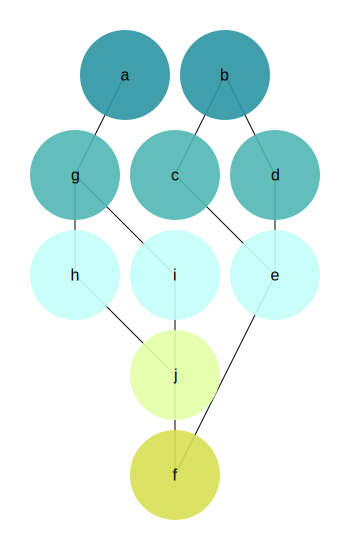

#dep-graph

This a test problem solution backing a job interview.

This program reads a dependency tree from a structured text file, finds independent groups of nodes and prints them out. It also draws the graph to in an svg file and generates a graphviz input file for dot.

Most of the example files are borrowed and processed into another format from the [graphviz gallery](http://www.graphviz.org/Gallery.php).

#build and run

`mkdir build; cd build; cmake ..; make; cd ..`

`build/bin/dep-graph example/simple.txt`

It should print the independent graph node groups and produce the `output.svg` and the `output.dot` files. 

`output.svg`:

To process the .dot file you need graphviz.

`dot -Tpng output.dot > output.png`
